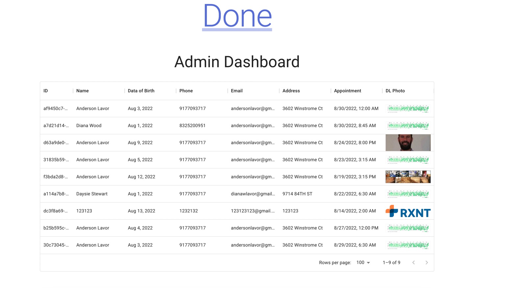

# Frontend Coding Challenge for Done.


##  Description

This project focus only on the Web and has no need of any backend project to be started.
It connects to an aws microservice backend.

This frontend project provides two user interfaces UI.
- UI 1: allows the customer to enter a registration Form and submit it.
- UI 2: allows the Administrator to view a list of all users and select any user on the list
to see their registration data by clicking anywhere on the row.


###  Steps to run the frontend project

This project can be ran in two ways:
- UI 1: On the web hosted on aws and is accessible from the following url:
  https://main.d38rb60bru34gq.amplifyapp.com/


- Locally by running the command:
    ```
  yarn && yarn start 
    ```
    Do not forget to run the command yarn install before running the command yarn start.


  Runs the app in the development mode.

  Open [http://localhost:3000](http://localhost:3000) to view it in the browser.


### Technologies used:
- React
- Typescript
- Material UI
- React-Router
- Formik
- Luxon
- Firebase
- AWS Amplify
- Github

### Screenshots
- Registration Form


- Admin View Users


- Admin View User Details

- 
#### The Application is hosted over AWS and is auto deployed from Github automatically.
